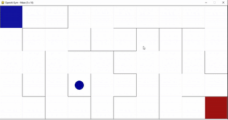

# neural-network-maze
## Задание
- Написать алгоритм генерации лабиринта
- Написать алгоритм обучения нейронной сети
## Необхдимые библиотеки
 - [gym](https://www.gymlibrary.ml/)
## Запуск
Запуск происходит путем запуска `main.py`
> python3 main.py
## Настройка обучения
Размер поля и константы обучения можно поменять в коде main.py
## Примеры работы
